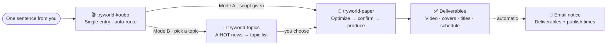

<p align="center">
  
</p>

<div align="center">
  <b style="font-family:Georgia,'Noto Serif SC','Songti SC','SimSun',serif; font-size:18px; color:#1C1916; letter-spacing:8px;">PAPER ALGORITHM · 纸上算法</b><br/>
  <span style="color:#5C5445; font-size:14px;">From one sentence to a full production line — making AI clear for everyone.</span>
</div>

<p align="center">
  <b>English</b> · <a href="README.zh-CN.md">简体中文</a>
</p>

<p align="center">
  
  
  
  
</p>

---

## 🧭 What Is This

**试界TryWorld official AI-agent skill set** — a complete Chinese voiceover-video production line, from one sentence to a delivered video. Topic selection, scriptwriting, polish, rendering, publish plan, and email notice are all packaged into three Skills:

- **🎬 `tryworld-koubo`** — the single entry. One sentence in, auto-routed through topics → script → polish → video.
- **🎯 `tryworld-topics`** — AIHOT-based topic selection: hundreds of daily AI headlines distilled into 3–8 fresh picks.
- **📜 `tryworld-paper`** — the "Paper Algorithm" video pipeline: script → branded 16:9 video with covers, titles, and captions.

Install them into `~/.agents/skills`, open a session in any agent host that reads that directory (e.g. Agent SDK / ZCode), and say one sentence in Chinese. The skills pick up the whole chain from there — topic list, scripts, rendered video, covers, titles, even the automatic email notice.

<div align="center">
<table style="border:1px solid #E4DCC8; border-radius:8px; background:#FBF7EC;">
<tr><td style="border-left:4px solid #C0452F; padding:14px 18px;">
  <b style="font-family:Georgia,'Noto Serif SC','Songti SC',serif; color:#1C1916; font-size:16px;">Paper is the stage, ink is the text, vermilion is the accent, the seal is the signature.</b><br/>
  <span style="color:#5C5445; font-size:13px;">Three skills, each guarding one page — together they form a single moving page of algorithm notes: from "what should I make this week" to delivered videos, automatic email notices, and a four-platform publishing schedule.</span>
</td></tr>
</table>
</div>

## ⏱ 30-Second Quick Start

**1 · Install** — clone the repo, then copy the skill folders into your skills directory:

```bash
git clone https://github.com/TryWorld2026/tryworld-skills.git
cd tryworld-skills
mkdir -p ~/.agents/skills
cp -r skills/* ~/.agents/skills/
```

On Windows PowerShell:

```powershell
git clone https://github.com/TryWorld2026/tryworld-skills.git
cd tryworld-skills
New-Item -ItemType Directory -Force -Path "$env:USERPROFILE\.agents\skills"
Copy-Item -Path .\skills\* -Destination "$env:USERPROFILE\.agents\skills" -Recurse
```

**2 · Say it** — open a session with your agent and just talk:

```text
帮我做一期口播
```

That's it. The request is recognized and routed through the whole pipeline automatically — no commands to memorize. You can also name a skill directly (`$tryworld-koubo`, `$tryworld-topics`, `$tryworld-paper`); the `$`-name is the skill's call sign in agent sessions.

**3 · Receive** — the pipeline ends with the rendered video, horizontal/vertical covers, platform titles, captions, a four-platform publish plan, and an automatic email notice.

---

## 📑 Contents

- [What Is This](#-what-is-this)
- [30-Second Quick Start](#-30-second-quick-start)
- [Three Pages · Skill Overview](#-three-pages--skill-overview)
- [The Voiceover Workflow](#-the-voiceover-workflow)
- [Paper Algorithm · Design System](#-paper-algorithm--design-system)
- [The Aliveness Gate](#-the-aliveness-gate)
- [Installation and Usage](#-installation-and-usage)
- [Repository Layout](#-repository-layout)
- [Use and Remix](#-use-and-remix)
- [License](#-license)

---

## 🧩 Three Pages · Skill Overview

<div align="center">
<table>
<tr>
<td width="33%" valign="top" style="border:1px solid #E4DCC8; border-top:3px solid #C0452F; background:#FBF7EC; border-radius:6px; padding:12px 14px;">
  <b style="font-family:Georgia,'Noto Serif SC','Songti SC',serif; color:#1C1916; font-size:15px;">🎬 Voiceover Router</b><br/>
  <span style="color:#C0452F; font-size:12px; font-weight:bold;">tryworld-koubo</span>
  <br/><br/><span style="font-size:13px; color:#1C1916;">One sentence in, auto-routed through topics, script, polish, and video production.</span>
  <br/><br/><span style="font-size:12px; color:#2E5E8C;">Delivers: full pipeline + email notice</span><br/>
  <code style="font-size:12px;">$tryworld-koubo</code>
</td>
<td width="34%" valign="top" style="border:1px solid #E4DCC8; border-top:3px solid #C0452F; background:#FBF7EC; border-radius:6px; padding:12px 14px;">
  <b style="font-family:Georgia,'Noto Serif SC','Songti SC',serif; color:#1C1916; font-size:15px;">📜 Paper Algorithm Video</b><br/>
  <span style="color:#C0452F; font-size:12px; font-weight:bold;">tryworld-paper</span>
  <br/><br/><span style="font-size:13px; color:#1C1916;">Script → branded horizontal video, a page of moving algorithm notes.</span>
  <br/><br/><span style="font-size:12px; color:#2E5E8C;">Delivers: video · covers · titles · captions</span><br/>
  <code style="font-size:12px;">$tryworld-paper</code>
</td>
<td width="33%" valign="top" style="border:1px solid #E4DCC8; border-top:3px solid #C0452F; background:#FBF7EC; border-radius:6px; padding:12px 14px;">
  <b style="font-family:Georgia,'Noto Serif SC','Songti SC',serif; color:#1C1916; font-size:15px;">🎯 AI Topic Selection</b><br/>
  <span style="color:#C0452F; font-size:12px; font-weight:bold;">tryworld-topics</span>
  <br/><br/><span style="font-size:13px; color:#1C1916;">Hundreds of daily AI headlines, distilled into 3-8 topics worth making — fresh, catchy, not repeated.</span>
  <br/><br/><span style="font-size:12px; color:#2E5E8C;">Delivers: topic list (angle · source · priority)</span><br/>
  <code style="font-size:12px;">$tryworld-topics</code>
</td>
</tr>
</table>
</div>

---

## 🎬 The Voiceover Workflow

Remember one entry: **`$tryworld-koubo`**. Hand it a script (Mode A) or ask for topics (Mode B).



---

## 🎨 Paper Algorithm · Design System

The visual contract behind every TryWorld video — **scientific manuscript + Chinese print tradition**, a locked contract with no shortcuts.

<div align="center">
<table>
<tr>
<td align="center" style="background:#F4EFE4; color:#1C1916; padding:10px 14px; border:1px solid #E4DCC8;">
  <b style="font-family:Georgia,'Noto Serif SC','Songti SC',serif;">Paper</b><br/>
  <code>#F4EFE4</code><br/>
  <small>Background</small>
</td>
<td align="center" style="background:#1C1916; color:#F4EFE4; padding:10px 14px; border:1px solid #E4DCC8;">
  <b style="font-family:Georgia,'Noto Serif SC','Songti SC',serif;">Ink</b><br/>
  <code>#1C1916</code><br/>
  <small>Text & lines</small>
</td>
<td align="center" style="background:#C0452F; color:#F4EFE4; padding:10px 14px; border:1px solid #E4DCC8;">
  <b style="font-family:Georgia,'Noto Serif SC','Songti SC',serif;">Vermillion</b><br/>
  <code>#C0452F</code><br/>
  <small>The only accent</small>
</td>
<td align="center" style="background:#2E5E8C; color:#F4EFE4; padding:10px 14px; border:1px solid #E4DCC8;">
  <b style="font-family:Georgia,'Noto Serif SC','Songti SC',serif;">Ink Blue</b><br/>
  <code>#2E5E8C</code><br/>
  <small>Notes & charts</small>
</td>
</tr>
</table>
</div>

| Dimension | Convention |
|---|---|
| **Type** | Noto Serif SC (headings) · ZCOOL XiaoWei (notes) · monospace (data) |
| **Motion** | ink drop · brush stroke · seal stamp — three signature moves throughout |
| **Authenticity** | vermilion「试界原创」seal, always visible top-right — the only watermark |

---

## 🔒 The Aliveness Gate

Before delivery, every polished script and platform title passes a machine gate — **the ban targets rhetorical moves, not literal strings**. Repeating the same move with different words still counts.

- **Flip-flop rhetoric**: sets up a misunderstanding the reader never had, then overturns it for dramatic lift. Known guises include 不是……而是……, 并非……而是……, 表面……实际……, 看似……实则……, 你以为……其实……, 回头才发现, 说到底, 答案恰恰相反 — state judgments directly, judgment first, evidence after.
- **Triple+ parallel structure**: three or more identical constructions; keep at most two.
- **Lyric metaphor**: no concrete verbs bolted onto abstract nouns ("time keeps the details" type); unaffected when writing about concrete things.
- **Nominalization**: "实现了效率的提升" → say how much faster, how many people saved.
- **Punctuation tiers**: all dashes banned; colons only to introduce direct speech.
- **Jargon tiers**: absolute bans + context-sensitive words, maintained by the checker.

`tryworld-paper/scripts/check_prose.py` (from [human-writing](https://github.com/KKKKhazix/human-writing) v1.1.0, MIT) runs these checks automatically and adds statistical signals — sentence-length variance, conjunction density, model-favorite lyric words, 「」-quote density. **Zero hard violations required before the user-confirmation gate; failing means no delivery.**

---

## 🛠 Installation and Usage

### Install

Each skill folder is a self-contained Skill. Copy it into your local skills directory:

```powershell
# Install all skills
Copy-Item -Path .\skills\* -Destination "$env:USERPROFILE\.agents\skills" -Recurse

# Or install a single skill
Copy-Item -Path .\skills\tryworld-paper -Destination "$env:USERPROFILE\.agents\skills" -Recurse
```

> Hosts that support the `~/.agents/skills` convention (e.g. Agent SDK / ZCode) pick these up automatically; for other hosts, point your host's skills directory at this path (see your host's docs). Note that `tryworld-koubo` routes to its sibling skills, so for the full pipeline install all three — see [Environment](#environment) for external dependencies.

### How to trigger

A skill fires when the request matches its trigger words — no commands to memorize:

- Say it in plain words: 「帮我做一期口播」「这周做什么口播」「把这篇稿子做成视频」…
- Name the skill explicitly: `$tryworld-koubo` / `$tryworld-topics` / `$tryworld-paper`
- Paste a script and ask to produce it — the router detects the input and goes straight into the video pipeline.

### What you get

| You say | Route | You get |
|---|---|---|
| 帮我做一期口播 / 帮我选题 | `$tryworld-koubo` (auto) | routed pipeline · publish plan · email notice |
| 这周做什么口播 | via koubo → tryworld-topics | 3–8 topic picks (angle · source · priority) |
| 把这篇稿子做成视频 | via koubo → tryworld-paper | 16:9 video · covers · titles · captions |

### Environment

Run `npx hyperframes doctor` to check the environment at once. These skills are built for TryWorld's own production workflow, so a few things are assumed — all adjustable in the skill files:

- **Windows PowerShell** — data-fetching (`tryworld-topics`) and email-notice (`tryworld-koubo`) scripts are PowerShell (`scripts/*.ps1`); `tryworld-topics` documents a curl fallback for non-Windows in its `references/`.
- **Python 3.10+** — `pip install edge-tts` for the Azure-Yunxi voiceover (`tryworld-paper/scripts/tts_yunxi.py`); `tryworld-paper/scripts/check_prose.py` needs no third-party packages.
- **Node.js >= 22 + HyperFrames** — rendering (`npx hyperframes render` / `lint` / `validate` / `inspect`).
- **FFmpeg** (with ffprobe, on PATH) — audio processing.
- **External skills** — `$hyperframes` (rendering, required) and `$qq-email` (email notice, optional) are not in this repo; install them separately.
- **Working directory** — finished projects land in `E:\Codex口播视频` by convention; change it in the skill files to your own.
- **Email notice** — requires `QQ_EMAIL_ACCOUNT` / `QQ_EMAIL_AUTH_CODE` credentials (via the `$qq-email` skill); skipped gracefully when absent.

Each skill folder carries its own `SKILL.md` with the full workflow and where to change environment defaults.

---

## 🗂 Repository Layout

```text
tryworld-skills/
├── assets/
│   ├── hero.svg                 # Brand banner
│   └── license-badge.svg        # License badge
├── README.md                    # Index (English)
├── README.zh-CN.md              # Index (简体中文)
├── LICENSE                      # CC BY-SA 4.0
└── skills/
    ├── tryworld-koubo/          # Voiceover router (routing + email notice)
    ├── tryworld-paper/          # Paper Algorithm video production
    └── tryworld-topics/         # AIHOT topic selection
```

---

## 🤝 Use and Remix

- **Fork, don't copy.** Use the fork button — it keeps the link back to this repository and its commit history.
- **Keep the upstream.** Every derivative repository must carry a visible attribution to this project (`TryWorld2026/tryworld-skills`) and the license notice.
- **Share alike.** Remixes must be released under the same license (CC BY-SA 4.0). A repository that doesn't carry this license statement is not licensed for derivative work.
- **Commercial use is welcome** — as long as the attribution and the license travel with it.

---

## 📄 License

This work is licensed under a **Creative Commons Attribution-ShareAlike 4.0 International (CC BY-SA 4.0)** license: share and adapt freely — including commercially — as long as you give credit, and any remix is released under the same license. Full terms: [LICENSE](LICENSE).

`tryworld-paper/scripts/check_prose.py` is derived from [human-writing](https://github.com/KKKKhazix/human-writing) v1.1.0 and remains under the **MIT License** (see `skills/tryworld-paper/LICENSE-MIT`); everything else in this repository is CC BY-SA 4.0.

[](https://creativecommons.org/licenses/by-sa/4.0/)

---

<p align="center"><sub>TryWorld · Making AI clear for everyone</sub></p>