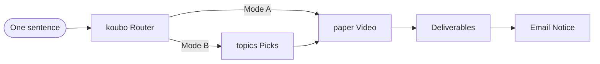

<p align="center">
  
</p>

<div align="center">
  <b style="font-family:Georgia,'Noto Serif SC','Songti SC','SimSun',serif; font-size:18px; color:#1C1916; letter-spacing:8px;">PAPER ALGORITHM · 纸上算法</b><br/>
  <span style="color:#5C5445; font-size:14px;">From one sentence to a full production line — making AI clear for everyone.</span>
</div>

<p align="center">
  <b>English</b> · <a href="README.zh-CN.md">简体中文</a>
</p>

<p align="center">
  
  
  
  
</p>

---

## 🧭 What Is This

**试界TryWorld official AI-agent skill set** — a complete Chinese voiceover-video production line, from one sentence to a delivered video. Topic selection, scriptwriting, polish, rendering, publish plan, and email notice are all packaged into three Skills:

- **🎬 `tryworld-koubo`** — the single entry. One sentence in, auto-routed through topics → script → polish → video.
- **🎯 `tryworld-topics`** — AIHOT-based topic selection: hundreds of daily AI headlines distilled into 3–8 fresh picks.
- **📜 `tryworld-paper`** — the "Paper Algorithm" video pipeline: script → branded 16:9 video with covers, titles, and captions.

Install them into `~/.agents/skills`, open a session in any agent host that reads that directory (e.g. Agent SDK / ZCode), and say one sentence in Chinese. The skills pick up the whole chain from there — topic list, scripts, rendered video, covers, titles, even the automatic email notice.

<div align="center">
<table style="border:1px solid #E4DCC8; border-radius:8px; background:#FBF7EC;">
<tr><td style="border-left:4px solid #C0452F; padding:14px 18px;">
  <b style="font-family:Georgia,'Noto Serif SC','Songti SC',serif; color:#1C1916; font-size:16px;">Paper is the stage, ink is the text, vermilion is the accent, the seal is the signature.</b><br/>
  <span style="color:#5C5445; font-size:13px;">Three skills, each guarding one page — together they form a single moving page of algorithm notes: from "what should I make this week" to delivered videos, automatic email notices, and a four-platform publishing schedule.</span>
</td></tr>
</table>
</div>

## ⏱ 30-Second Quick Start

**1 · Install** — clone the repo, then copy the skill folders into your skills directory:

```bash
git clone https://github.com/TryWorld2026/paper-algorithm.git
cd paper-algorithm
mkdir -p ~/.agents/skills
cp -r skills/* ~/.agents/skills/
```

On Windows PowerShell:

```powershell
git clone https://github.com/TryWorld2026/paper-algorithm.git
cd paper-algorithm
New-Item -ItemType Directory -Force -Path "$env:USERPROFILE\.agents\skills"
Copy-Item -Path .\skills\* -Destination "$env:USERPROFILE\.agents\skills" -Recurse
```

**2 · Say it** — open a session with your agent and just talk:

```text
帮我做一期口播
```

That's it. The request is recognized and routed through the whole pipeline automatically — no commands to memorize. You can also name a skill directly (`$tryworld-koubo`, `$tryworld-topics`, `$tryworld-paper`); the `$`-name is the skill's call sign in agent sessions.

**3 · Receive** — the pipeline ends with the rendered video, horizontal/vertical covers, platform titles, captions, a four-platform publish plan, and an automatic email notice.

**Check your setup** — run `python -X utf8 scripts/check_skills.py` (should output `All checks passed`) and `python scripts/doctor.py` (lists missing tools, cross-platform) before producing your first video. See [CONTRIBUTING.md](CONTRIBUTING.md) for how to contribute, [CHANGELOG.md](CHANGELOG.md) for recent changes, and the [Code of Conduct](CODE_OF_CONDUCT.md).

---


### Pipeline Runner (Optional)

After installation, use the pipeline runner instead of manually executing steps. The runner runs 6 step scripts in order, checks preconditions at each step, and stops on failure:

```bash
# List all steps
python -m pipeline.runner --list

# Preview execution plan
python -m pipeline.runner --dry-run

# Run steps (step 3 confirmation gate requires --confirm to pass)
python -m pipeline.runner --project-dir <project-dir> --steps 1,2

# Continue after confirmation
python -m pipeline.runner --project-dir <project-dir> --steps 3,4,5,6
```

Six steps: `01 optimize` → `02 check_prose` → `03 confirm` (hard gate) → `04 tts` → `05 render` → `06 verify` (hard gate).

---
## 📑 Contents

- [What Is This](#-what-is-this)
- [30-Second Quick Start](#-30-second-quick-start)
- [Pipeline Runner](#pipeline-runner-optional)
- [Three Pages · Skill Overview](#-three-pages--skill-overview)
- [Showcase](#-showcase)
- [The Voiceover Workflow](#-the-voiceover-workflow)
- [Paper Algorithm · Design System](#-paper-algorithm--design-system)
- [Voice Presets](#-voice-presets)
- [Themes](#-themes)
- [For AI Agents](#-for-ai-agents)
- [The Aliveness Gate](#-the-aliveness-gate)
- [Installation and Usage](#-installation-and-usage)
- [Repository Layout](#-repository-layout)
- [Use and Remix](#-use-and-remix)
- [License](#-license)

---

## 🧩 Three Pages · Skill Overview

<div align="center">
<table>
<tr>
<td width="33%" valign="top" style="border:1px solid #E4DCC8; border-top:3px solid #C0452F; background:#FBF7EC; border-radius:6px; padding:12px 14px;">
  <b style="font-family:Georgia,'Noto Serif SC','Songti SC',serif; color:#1C1916; font-size:15px;">🎬 Voiceover Router</b><br/>
  <span style="color:#C0452F; font-size:12px; font-weight:bold;">tryworld-koubo</span>
  <br/><br/><span style="font-size:13px; color:#1C1916;">One sentence in, auto-routed through topics, script, polish, and video production.</span>
  <br/><br/><span style="font-size:12px; color:#2E5E8C;">Delivers: full pipeline + email notice</span><br/>
  <code style="font-size:12px;">$tryworld-koubo</code>
</td>
<td width="34%" valign="top" style="border:1px solid #E4DCC8; border-top:3px solid #C0452F; background:#FBF7EC; border-radius:6px; padding:12px 14px;">
  <b style="font-family:Georgia,'Noto Serif SC','Songti SC',serif; color:#1C1916; font-size:15px;">📜 Paper Algorithm Video</b><br/>
  <span style="color:#C0452F; font-size:12px; font-weight:bold;">tryworld-paper</span>
  <br/><br/><span style="font-size:13px; color:#1C1916;">Script → branded horizontal video, a page of moving algorithm notes.</span>
  <br/><br/><span style="font-size:12px; color:#2E5E8C;">Delivers: video · covers · titles · captions · multi-voice</span><br/>
  <code style="font-size:12px;">$tryworld-paper</code>
</td>
<td width="33%" valign="top" style="border:1px solid #E4DCC8; border-top:3px solid #C0452F; background:#FBF7EC; border-radius:6px; padding:12px 14px;">
  <b style="font-family:Georgia,'Noto Serif SC','Songti SC',serif; color:#1C1916; font-size:15px;">🎯 AI Topic Selection</b><br/>
  <span style="color:#C0452F; font-size:12px; font-weight:bold;">tryworld-topics</span>
  <br/><br/><span style="font-size:13px; color:#1C1916;">Hundreds of daily AI headlines, distilled into 3-8 topics worth making — fresh, catchy, not repeated.</span>
  <br/><br/><span style="font-size:12px; color:#2E5E8C;">Delivers: topic list (angle · source · priority)</span><br/>
  <code style="font-size:12px;">$tryworld-topics</code>
</td>
</tr>
</table>
</div>

---

## 🎬 Showcase

Real outputs from the pipeline — everything below was produced end-to-end by these skills, with no manual editing. Videos are 720p previews (originals are ~30–45 MB, 1080p); each folder also carries the voiceover script, platform titles, and the publish plan.

<p align="center">
  
  &nbsp;
  
</p>

| Example | Topic | Length | Video preview | In the folder |
|---|---|---|---|---|
| [cordis-paper](examples/cordis-paper/) | DeepSeek 论文精读：把拆插件讲成数学 | 8.8 min | [preview_720p.mp4](examples/cordis-paper/preview_720p.mp4) · 12 MB | [covers](examples/cordis-paper/cover_4x3.png) · [titles](examples/cordis-paper/titles.txt) · [script](examples/cordis-paper/2026-08-23_Cordis论文精读_口播稿.md) · [publish plan](examples/cordis-paper/发布计划.txt) |
| [cursor-spacex](examples/cursor-spacex/) | SpaceX 买下 Cursor | 6.6 min | [preview_720p.mp4](examples/cursor-spacex/preview_720p.mp4) · 8 MB | [covers](examples/cursor-spacex/cover_4x3.png) · [titles](examples/cursor-spacex/titles.txt) · [script](examples/cursor-spacex/2026-08-16_Cursor被SpaceX收购_口播稿.md) · [publish plan](examples/cursor-spacex/发布计划.txt) |

---

## 🎬 The Voiceover Workflow

Remember one entry: **`$tryworld-koubo`**. Hand it a script (Mode A) or ask for topics (Mode B).



---

## 🎨 Paper Algorithm · Design System

The visual contract behind every TryWorld video — **scientific manuscript + Chinese print tradition**, a locked contract with no shortcuts.

<div align="center">
<table>
<tr>
<td align="center" style="background:#F4EFE4; color:#1C1916; padding:10px 14px; border:1px solid #E4DCC8;">
  <b style="font-family:Georgia,'Noto Serif SC','Songti SC',serif;">Paper</b><br/>
  <code>#F4EFE4</code><br/>
  <small>Background</small>
</td>
<td align="center" style="background:#1C1916; color:#F4EFE4; padding:10px 14px; border:1px solid #E4DCC8;">
  <b style="font-family:Georgia,'Noto Serif SC','Songti SC',serif;">Ink</b><br/>
  <code>#1C1916</code><br/>
  <small>Text & lines</small>
</td>
<td align="center" style="background:#C0452F; color:#F4EFE4; padding:10px 14px; border:1px solid #E4DCC8;">
  <b style="font-family:Georgia,'Noto Serif SC','Songti SC',serif;">Vermillion</b><br/>
  <code>#C0452F</code><br/>
  <small>The only accent</small>
</td>
<td align="center" style="background:#2E5E8C; color:#F4EFE4; padding:10px 14px; border:1px solid #E4DCC8;">
  <b style="font-family:Georgia,'Noto Serif SC','Songti SC',serif;">Ink Blue</b><br/>
  <code>#2E5E8C</code><br/>
  <small>Notes & charts</small>
</td>
</tr>
</table>
</div>

| Dimension | Convention |
|---|---|
| **Type** | Noto Serif SC (headings) · ZCOOL XiaoWei (notes) · monospace (data) |
| **Motion** | ink drop · brush stroke · seal stamp — three signature moves throughout |
| **Authenticity** | vermilion「试界原创」seal, always visible top-right — the only watermark |

---

## 🎙 Voice Presets

The voiceover defaults to **Yunxi** (云希, TryWorld's brand voice), with seven more presets built in — one flag to switch:

| Preset | Voice | Character | Audition |
|---|---|---|---|
| `yunxi` (default) | 云希 | male, sunny | [▶ listen](assets/voice-samples/yunxi.mp3) |
| `xiaoxiao` | 晓晓 | female, warm | [▶ listen](assets/voice-samples/xiaoxiao.mp3) |
| `xiaoyi` | 晓伊 | female, lively | [▶ listen](assets/voice-samples/xiaoyi.mp3) |
| `yunjian` | 云健 | male, passionate | [▶ listen](assets/voice-samples/yunjian.mp3) |
| `yunyang` | 云扬 | male, news anchor | [▶ listen](assets/voice-samples/yunyang.mp3) |
| `yunxia` | 云夏 | male, youthful | [▶ listen](assets/voice-samples/yunxia.mp3) |
| `xiaobei` | 小贝 | female, Northeastern dialect | [▶ listen](assets/voice-samples/xiaobei.mp3) |
| `xiaoni` | 小妮 | female, Shaanxi dialect | [▶ listen](assets/voice-samples/xiaoni.mp3) |

All samples above are synthesized with TryWorld's fixed sign-off line, so you hear each voice exactly as it sounds in a real video.

---

## 🎨 Themes

The default look is the **Paper Algorithm** theme (TryWorld's brand), but all brand values — palette, fonts, seal, platform name, sign-off, cover style, default voice — live in one theme file: `skills/tryworld-paper/themes/paper-algorithm.json`.

Want your own brand on this pipeline? Copy the theme JSON, change the values following `tryworld-paper/references/theme-guide.md`, and ship videos under your name. The pipeline contract is not configurable — confirmation gates, the aliveness-gate check, burned-in captions, and quality checks all stay — only the skin changes. Content theme (`content-default.json`) defines topic domain, audience, length range, and target platforms — modify this JSON to change domain/brand, SKILL.md references it automatically. Writing methodology is in `tryworld-koubo/references/writing-methodology.md`; set `"writing_rules": "custom"` in the content theme to replace with your own methodology (but the `check_prose.py` hard gate cannot be disabled). The repo includes `test-brand.json` as a complete rebranding example.

```jsonc
// themes/your-brand.json (excerpt)
{
  "brand": { "platform_name": "YourChannel", "seal_text": "原创认证", "sign_off": "..." },
  "palette": { "background": "#F7F7F2", "text": "#111111", "accent": "#0F62FE", "secondary": "#5A6B7B" }
}
```

Community themes are welcome — PR to `skills/tryworld-paper/themes/` with a 720p sample (CC BY-SA 4.0 applies).

---

## 🤖 For AI Agents

If you are an AI coding agent (Claude Code / Codex / Cursor …) whose user installed or cloned this repo, this section is your operating manual. The human talks; you drive the pipeline.

### 1. Skills are executable manuals

Each folder under `skills/` is a skill whose `SKILL.md` is a complete, executable instruction set:

| Skill | Role | Read it when |
|---|---|---|
| `skills/tryworld-koubo/SKILL.md` | Single entry / router | Any voiceover request (make an episode, pick topics, optimize a script) |
| `skills/tryworld-paper/SKILL.md` | Script → video production | Once a script is confirmed for production |
| `skills/tryworld-topics/SKILL.md` | AIHOT topic selection | Mode B topic picking |

After installation into `~/.agents/skills`, hosts trigger these by the `description` frontmatter; when the user names one (`$tryworld-koubo`), open its SKILL.md and follow it literally.

### 2. The execution sequence for one full episode

1. **Route** — read `tryworld-koubo/SKILL.md`, decide Mode A (user gave a script → optimize & produce) or Mode B (topic request → select → write → produce).
2. **Environment check** — `node --version` (≥22) · `python --version` (≥3.10) · `python -c "import edge_tts"` · `ffmpeg -version` · `npx hyperframes doctor`. Install or warn on whatever is missing before proceeding.
3. **Mode B only** — run `python tryworld-topics/scripts/fetch_aihot.py` (cross-platform) or the curl fallback in its `references/api.md`, apply `references/selection-rules.md`, produce 3–8 candidate topics.
4. **Gate 1 (STOP)** — present the topic list and wait for the user's pick. Do not proceed unasked.
5. **Write** — follow the writing rules in koubo's SKILL.md (2,500–2,800 chars standard, sources for every datapoint, aliveness rules).
6. **Polish & gate** — hand over to `tryworld-paper/SKILL.md`: optimize, then run `scripts/check_prose.py` until zero hard violations.
7. **Gate 2 (STOP)** — show the full polished script + what/why of edits + element mapping + data sources. Wait for explicit confirmation. Never render without it.
8. **Produce** — read the theme file (`skills/tryworld-paper/themes/paper-algorithm.json`) for all brand values → segment → `scripts/tts_yunxi.py` (voiceover + `sentences.json` timeline) → build HyperFrames compositions per `references/style-system.md` → `npx hyperframes lint` / `validate` / `inspect --strict` all pass → render (draft first, then high) → covers (independent design, never video frames) → titles per `references/titles.md` → everything into `outputs/` + `发布计划.txt`.
9. **Notify** — run `python tryworld-koubo/scripts/notify_delivery.py --project-dir <dir>`; missing credentials/node → skip gracefully, never block delivery.
10. **Verify before delivery (hard gate)** — run `python -X utf8 tryworld-paper/scripts/verify_output.py --dir <outputs>`; every item must PASS (audio track present, durations aligned, both cover sizes, titles, publish plan). A FAIL means fix and re-run — never deliver an unverified outputs folder.

Projects live in their own folder (default convention: `E:\Codex口播视频\<slug>\` with `work/` and `outputs/`).

### 3. Hard rules (violating any = task failed)

- Both gates require the user's explicit confirmation. Never self-advance past a gate.
- `check_prose.py` hard violations must be zero before the polished script may even be shown.
- Brand values (palette, seal, sign-off, fonts, default voice) come **only** from the theme file — never hardcode them from memory.
- Before rendering, `lint`/`validate`/`inspect --strict` must pass with zero errors and warnings.
- Script data points need sources; unverifiable ones are marked 待核实, never invented.
- Run `verify_output.py` on `outputs/` before handing anything to the user; a silent video or a missing cover is a failed delivery.

### 4. Common failures

| Symptom | Fix |
|---|---|
| `npx hyperframes` missing | First `npx` call auto-installs it; needs Node ≥22 |
| edge-tts 403 / rate limit | The tts script auto-retries once on failure; the AIHOT fetch script retries 429/5xx with backoff — retry or switch network |
| Email notice fails | Credentials missing → it skips by design; delivery is not blocked |
| Fonts wrong in render | Check `style-system.md` font embed table; non-native fonts need bundled woff2 |

```powershell
python tryworld-paper/scripts/tts_yunxi.py script.txt --out work/audio --voice xiaoxiao
```

Full edge-tts voice ids are accepted too. By default the pipeline never asks about voices — say you want a different one (a female voice, a news-anchor feel) and it synthesizes short auditions from your own script for you to pick.

---

## 🔒 The Aliveness Gate

Before delivery, every polished script and platform title passes a machine gate — **the ban targets rhetorical moves, not literal strings**. Repeating the same move with different words still counts.

- **Flip-flop rhetoric**: sets up a misunderstanding the reader never had, then overturns it for dramatic lift. Known guises include 不是……而是……, 并非……而是……, 表面……实际……, 看似……实则……, 你以为……其实……, 回头才发现, 说到底, 答案恰恰相反 — state judgments directly, judgment first, evidence after.
- **Triple+ parallel structure**: three or more identical constructions; keep at most two.
- **Lyric metaphor**: no concrete verbs bolted onto abstract nouns ("time keeps the details" type); unaffected when writing about concrete things.
- **Nominalization**: "实现了效率的提升" → say how much faster, how many people saved.
- **Punctuation tiers**: all dashes banned; colons only to introduce direct speech.
- **Jargon tiers**: absolute bans + context-sensitive words, maintained by the checker.

`tryworld-paper/scripts/check_prose.py` (from [human-writing](https://github.com/KKKKhazix/human-writing) v1.1.0, MIT) runs these checks automatically and adds statistical signals — sentence-length variance, conjunction density, model-favorite lyric words, 「」-quote density. **Zero hard violations required before the user-confirmation gate; failing means no delivery.**

---

## 🛠 Installation and Usage

### Install

Each skill folder is a self-contained Skill. Copy it into your local skills directory:

```powershell
# Install all skills
Copy-Item -Path .\skills\* -Destination "$env:USERPROFILE\.agents\skills" -Recurse

# Or install a single skill
Copy-Item -Path .\skills\tryworld-paper -Destination "$env:USERPROFILE\.agents\skills" -Recurse
```

> Hosts that support the `~/.agents/skills` convention (e.g. Agent SDK / ZCode) pick these up automatically; for other hosts, point your host's skills directory at this path (see your host's docs). Note that `tryworld-koubo` routes to its sibling skills, so for the full pipeline install all three — see [Environment](#environment) for external dependencies.

### How to trigger

A skill fires when the request matches its trigger words — no commands to memorize:

- Say it in plain words: 「帮我做一期口播」「这周做什么口播」「把这篇稿子做成视频」…
- Name the skill explicitly: `$tryworld-koubo` / `$tryworld-topics` / `$tryworld-paper`
- Paste a script and ask to produce it — the router detects the input and goes straight into the video pipeline.

### What you get

| You say | Route | You get |
|---|---|---|
| 帮我做一期口播 / 帮我选题 | `$tryworld-koubo` (auto) | routed pipeline · publish plan · email notice |
| 这周做什么口播 | via koubo → tryworld-topics | 3–8 topic picks (angle · source · priority) |
| 把这篇稿子做成视频 | via koubo → tryworld-paper | 16:9 video · covers · titles · captions |

### In-repo check scripts

- `python -X utf8 scripts/check_skills.py`: compiles skill Python scripts and runs the aliveness gate
- `python -m pytest tests/ -v`: run 23 unit tests (check_prose, verify_output, tts_yunxi, check_skills) over `examples/` scripts and titles.
- `python scripts/doctor.py`: checks Python, Node, FFmpeg/ffprobe, edge-tts, HyperFrames, and optional email credentials. Exits 1 when a required item is missing.

### Environment

Run `npx hyperframes doctor` to check the environment at once. These skills are built for TryWorld's own production workflow, so a few things are assumed — all adjustable in the skill files:

- **Cross-platform** — data-fetching (`tryworld-topics`) and email-notice (`tryworld-koubo`) scripts are Python (`.ps1` fallback versions retained); `tryworld-topics` documents a curl fallback in its `references/`.
- **Python 3.10+** — `pip install edge-tts` for the voiceover pipeline (`tryworld-paper/scripts/tts_yunxi.py`, default Yunxi + voice presets); `tryworld-paper/scripts/check_prose.py` needs no third-party packages.
- **Node.js >= 22 + HyperFrames** — rendering (`npx hyperframes render` / `lint` / `validate` / `inspect`).
- **FFmpeg** (with ffprobe, on PATH) — audio processing.
- **External skills** — `$hyperframes` (rendering, required) and `$qq-email` (email notice, optional) are not in this repo; install them separately.
- **Working directory** — finished projects land in `E:\Codex口播视频` by convention; change it in the skill files to your own.
- **Email notice** — requires `QQ_EMAIL_ACCOUNT` / `QQ_EMAIL_AUTH_CODE` credentials (via the `$qq-email` skill); skipped gracefully when absent.

Each skill folder carries its own `SKILL.md` with the full workflow and where to change environment defaults.

---


### Docker One-Shot Environment

Skip all dependency installs with Docker:

```bash
docker build -t paper-algorithm .
docker run --rm paper-algorithm
```

Container includes Node.js 22, FFmpeg, Python 3.12, edge-tts, and mutagen.

---

## 🗂 Repository Layout

```text
paper-algorithm/
├── assets/
│   ├── hero.svg                 # Brand banner
│   └── license-badge.svg        # License badge
├── README.md                    # Index (English)
├── README.zh-CN.md              # Index (简体中文)
├── scripts/                      # In-repo checks (static gates + doctor)
├── LICENSE                      # CC BY-SA 4.0
├── examples/                    # Real pipeline outputs (showcase)
│   ├── cordis-paper/            # Sample: 720p preview · covers · titles · script
│   └── cursor-spacex/           # Sample: 720p preview · covers · titles · script
└── skills/
    ├── tryworld-koubo/          # Voiceover router (routing + email notice)
    ├── tryworld-paper/          # Paper Algorithm video production
    │   ├── themes/              # Brand theme files (paper-algorithm.json)
    └── tryworld-topics/         # AIHOT topic selection
```

---

## 🤝 Use and Remix

- **Fork, don't copy.** Use the fork button — it keeps the link back to this repository and its commit history.
- **Keep the upstream.** Every derivative repository must carry a visible attribution to this project (`TryWorld2026/paper-algorithm`) and the license notice.
- **Share alike.** Remixes must be released under the same license (CC BY-SA 4.0). A repository that doesn't carry this license statement is not licensed for derivative work.
- **Commercial use is welcome** — as long as the attribution and the license travel with it.

---

## 📄 License

This work is licensed under a **Creative Commons Attribution-ShareAlike 4.0 International (CC BY-SA 4.0)** license: share and adapt freely — including commercially — as long as you give credit, and any remix is released under the same license. Full terms: [LICENSE](LICENSE).

`tryworld-paper/scripts/check_prose.py` is derived from [human-writing](https://github.com/KKKKhazix/human-writing) v1.1.0 and remains under the **MIT License** (see `skills/tryworld-paper/LICENSE-MIT`); everything else in this repository is CC BY-SA 4.0.

[](https://creativecommons.org/licenses/by-sa/4.0/)

---

<p align="center"><sub>TryWorld · Making AI clear for everyone</sub></p>
