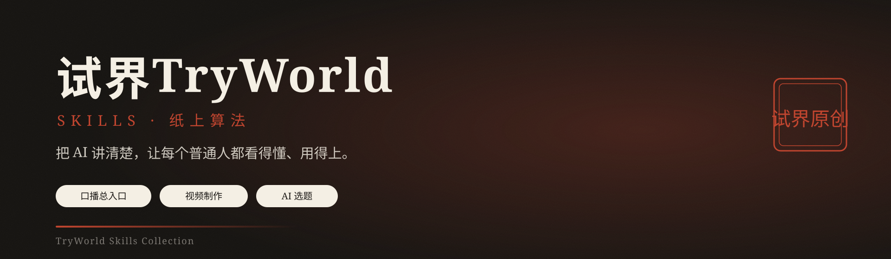

<p align="center">
  
</p>

<div align="center">
  <b style="font-family:Georgia,'Noto Serif SC','Songti SC','SimSun',serif; font-size:18px; color:#1C1916; letter-spacing:8px;">纸上算法 · PAPER ALGORITHM</b><br/>
  <span style="color:#5C5445; font-size:14px;">从一句话到一条生产线——把 AI 讲清楚，让每个普通人都看得懂、用得上。</span>
</div>

<p align="center">
  <a href="README.md">English</a> · <b>简体中文</b>
</p>

<p align="center">
  
  
  
  
</p>

---

## 🧭 这是什么

**试界TryWorld 官方 AI 技能合集**——一条完整的中文口播视频生产线：从一句话到成片。选题、写稿、优化、出片、发布计划、邮件通知，全部打包成三个 Skill：

- **🎬 `tryworld-koubo`**——统一入口。一句人话，自动路由选题 → 写稿 → 优化 → 出片。
- **🎯 `tryworld-topics`**——AIHOT 选题。每天几百条 AI 资讯，压成 3–8 个能做、能火、不重复的选题。
- **📜 `tryworld-paper`**——纸上算法出片。口播稿 → 品牌化 16:9 横屏视频，含封面、标题、字幕。

装进 `~/.agents/skills` 后，在任何支持该目录约定的 AI 工具（如 Agent SDK / ZCode）的会话里说一句中文，整条链路就从选题清单、口播稿、渲染成片、封面标题，一直到自动邮件通知自动走完，不需要你记任何命令。

<div align="center">
<table style="border:1px solid #E4DCC8; border-radius:8px; background:#FBF7EC;">
<tr><td style="border-left:4px solid #C0452F; padding:14px 18px;">
  <b style="font-family:Georgia,'Noto Serif SC','Songti SC',serif; color:#1C1916; font-size:16px;">纸面是舞台，墨迹是文字，朱红是重点，印章是签名。</b><br/>
  <span style="color:#5C5445; font-size:13px;">三个技能各守一页，合起来就是一页会动的算法笔记——从「这周做什么」到成片交付、自动邮件通知、四平台发布计划。</span>
</td></tr>
</table>
</div>

## ⏱ 30 秒上手

**第 1 步 · 安装**——克隆仓库，再把技能文件夹复制到你的技能目录：

```bash
git clone https://github.com/TryWorld2026/paper-algorithm.git
cd paper-algorithm
mkdir -p ~/.agents/skills
cp -r skills/* ~/.agents/skills/
```

Windows PowerShell 等价命令：

```powershell
git clone https://github.com/TryWorld2026/paper-algorithm.git
cd paper-algorithm
New-Item -ItemType Directory -Force -Path "$env:USERPROFILE\.agents\skills"
Copy-Item -Path .\skills\* -Destination "$env:USERPROFILE\.agents\skills" -Recurse
```

**第 2 步 · 说话**——打开 AI 工具会话，直接说：

```text
帮我做一期口播
```

就这样。请求会被自动识别并路由到整条流水线，不用记任何命令。也可以直接点名技能（`$tryworld-koubo`、`$tryworld-topics`、`$tryworld-paper`）；带 `$` 的名字就是技能在会话里的呼号。

**第 3 步 · 收货**——流水线末端交付：渲染成片、横竖封面、平台标题、字幕、四平台发布计划，外加一封自动邮件通知。

**检查环境**——出第一条视频前，先跑 `python -X utf8 scripts/check_skills.py`（应输出 `All checks passed`）和 `python scripts/doctor.py`（列出缺失工具，跨平台）。参与贡献见 [CONTRIBUTING.md](CONTRIBUTING.md)，近期改动见 [CHANGELOG.md](CHANGELOG.md)，社区准则见 [行为准则](CODE_OF_CONDUCT.md)。

---


### Pipeline Runner（可选）

安装后可以用 pipeline runner 代替手动执行流程。Runner 按编号顺序运行 6 个步骤脚本，每步检查前置条件，失败即停：

```bash
# 查看所有步骤
python -m pipeline.runner --list

# 预览执行计划
python -m pipeline.runner --dry-run

# 执行全部步骤（步骤 3 确认闸门必须加 --confirm 才能通过）
python -m pipeline.runner --project-dir <项目目录> --steps 1,2

# 确认后继续
python -m pipeline.runner --project-dir <项目目录> --steps 3,4,5,6
```

六个步骤：`01 optimize` → `02 check_prose` → `03 confirm`（硬闸门）→ `04 tts` → `05 render` → `06 verify`（硬闸门）。

---
## 📑 目录

- [这是什么](#-这是什么)
- [30 秒上手](#-30-秒上手)
- [Pipeline Runner](#pipeline-runner可选)
- [三张纸页 · 技能总览](#-三张纸页--技能总览)
- [效果展示](#-效果展示)
- [一条口播工作流](#-一条口播工作流)
- [纸上算法 · 设计系统](#-纸上算法--设计系统)
- [配音音色](#-配音音色)
- [主题](#-主题)
- [给 AI 的使用说明](#-给-ai-的使用说明)
- [活人感门禁](#-活人感门禁)
- [安装与使用](#-安装与使用)
- [仓库结构](#-仓库结构)
- [使用与二创](#-使用与二创)
- [许可](#-许可)

---

## 🧩 三张纸页 · 技能总览

<div align="center">
<table>
<tr>
<td width="33%" valign="top" style="border:1px solid #E4DCC8; border-top:3px solid #C0452F; background:#FBF7EC; border-radius:6px; padding:12px 14px;">
  <b style="font-family:Georgia,'Noto Serif SC','Songti SC',serif; color:#1C1916; font-size:15px;">🎬 口播总入口</b><br/>
  <span style="color:#C0452F; font-size:12px; font-weight:bold;">tryworld-koubo</span>
  <br/><br/><span style="font-size:13px; color:#1C1916;">一句人话，自动路由选题、写稿、优化、出片。</span>
  <br/><br/><span style="font-size:12px; color:#2E5E8C;">产出：全流程交付 + 邮件通知</span><br/>
  <code style="font-size:12px;">$tryworld-koubo</code>
</td>
<td width="34%" valign="top" style="border:1px solid #E4DCC8; border-top:3px solid #C0452F; background:#FBF7EC; border-radius:6px; padding:12px 14px;">
  <b style="font-family:Georgia,'Noto Serif SC','Songti SC',serif; color:#1C1916; font-size:15px;">📜 纸上算法视频</b><br/>
  <span style="color:#C0452F; font-size:12px; font-weight:bold;">tryworld-paper</span>
  <br/><br/><span style="font-size:13px; color:#1C1916;">口播稿 → 品牌化横屏视频，一页会动的算法笔记。</span>
  <br/><br/><span style="font-size:12px; color:#2E5E8C;">产出：主视频 · 横竖封面 · 标题 · 字幕 · 多音色</span><br/>
  <code style="font-size:12px;">$tryworld-paper</code>
</td>
<td width="33%" valign="top" style="border:1px solid #E4DCC8; border-top:3px solid #C0452F; background:#FBF7EC; border-radius:6px; padding:12px 14px;">
  <b style="font-family:Georgia,'Noto Serif SC','Songti SC',serif; color:#1C1916; font-size:15px;">🎯 AI 口播选题</b><br/>
  <span style="color:#C0452F; font-size:12px; font-weight:bold;">tryworld-topics</span>
  <br/><br/><span style="font-size:13px; color:#1C1916;">每天几百条 AI 新闻，压成 3-8 个能做、能火、不重复的选题。</span>
  <br/><br/><span style="font-size:12px; color:#2E5E8C;">产出：选题清单（角度 · 来源 · 优先级）</span><br/>
  <code style="font-size:12px;">$tryworld-topics</code>
</td>
</tr>
</table>
</div>

---

## 🎬 效果展示

以下全部由本流水线端到端产出，无人工后期。视频为 720p 预览（原片 1080p、约 30-45MB）；每个文件夹内含口播稿、平台标题与发布计划。

<p align="center">
  
  &nbsp;
  
</p>

| 示例 | 主题 | 时长 | 视频预览 | 文件夹内容 |
|---|---|---|---|---|
| [cordis-paper](examples/cordis-paper/) | DeepSeek 论文精读：把拆插件讲成数学 | 8.8 分钟 | [preview_720p.mp4](examples/cordis-paper/preview_720p.mp4) · 12 MB | [封面](examples/cordis-paper/cover_4x3.png) · [标题](examples/cordis-paper/titles.txt) · [口播稿](examples/cordis-paper/2026-08-23_Cordis论文精读_口播稿.md) · [发布计划](examples/cordis-paper/发布计划.txt) |
| [cursor-spacex](examples/cursor-spacex/) | SpaceX 买下 Cursor | 6.6 分钟 | [preview_720p.mp4](examples/cursor-spacex/preview_720p.mp4) · 8 MB | [封面](examples/cursor-spacex/cover_4x3.png) · [标题](examples/cursor-spacex/titles.txt) · [口播稿](examples/cursor-spacex/2026-08-16_Cursor被SpaceX收购_口播稿.md) · [发布计划](examples/cursor-spacex/发布计划.txt) |

---

## 🎬 一条口播工作流

只记一个入口：**`$tryworld-koubo`**。给稿走模式 A，要选题走模式 B。


---

## 🎨 纸上算法 · 设计系统

试界视频的视觉契约——**科学手稿 + 中文印刷传统**，一条不允许为省事让步的锁定契约。

<div align="center">
<table>
<tr>
<td align="center" style="background:#F4EFE4; color:#1C1916; padding:10px 14px; border:1px solid #E4DCC8;">
  <b style="font-family:Georgia,'Noto Serif SC','Songti SC',serif;">纸面</b><br/>
  <code>#F4EFE4</code><br/>
  <small>背景主色</small>
</td>
<td align="center" style="background:#1C1916; color:#F4EFE4; padding:10px 14px; border:1px solid #E4DCC8;">
  <b style="font-family:Georgia,'Noto Serif SC','Songti SC',serif;">墨黑</b><br/>
  <code>#1C1916</code><br/>
  <small>主文字 · 线条</small>
</td>
<td align="center" style="background:#C0452F; color:#F4EFE4; padding:10px 14px; border:1px solid #E4DCC8;">
  <b style="font-family:Georgia,'Noto Serif SC','Songti SC',serif;">朱红</b><br/>
  <code>#C0452F</code><br/>
  <small>唯一强调色</small>
</td>
<td align="center" style="background:#2E5E8C; color:#F4EFE4; padding:10px 14px; border:1px solid #E4DCC8;">
  <b style="font-family:Georgia,'Noto Serif SC','Songti SC',serif;">墨水蓝</b><br/>
  <code>#2E5E8C</code><br/>
  <small>次级批注 · 图表</small>
</td>
</tr>
</table>
</div>

| 维度 | 约定 |
|---|---|
| **字体** | 思源宋体（主标题）· ZCOOL 小薇（批注）· 等宽字体（数据） |
| **动效** | 墨落纸 · 笔写入 · 盖章——全片三种签名动效 |
| **防伪** | 朱红「试界原创」印章右上角全程常驻，是视频唯一水印 |

---

## 🎙 配音音色

配音默认 **云希**（试界品牌音色），内置七个可切换预设，一个参数就能换：

| 预设名 | 音色 | 特点 | 试听 |
|---|---|---|---|
| `yunxi`（默认） | 云希 | 男 · 阳光 | [▶ 试听](assets/voice-samples/yunxi.mp3) |
| `xiaoxiao` | 晓晓 | 女 · 温暖 | [▶ 试听](assets/voice-samples/xiaoxiao.mp3) |
| `xiaoyi` | 晓伊 | 女 · 活泼 | [▶ 试听](assets/voice-samples/xiaoyi.mp3) |
| `yunjian` | 云健 | 男 · 浑厚激情 | [▶ 试听](assets/voice-samples/yunjian.mp3) |
| `yunyang` | 云扬 | 男 · 新闻播报 | [▶ 试听](assets/voice-samples/yunyang.mp3) |
| `yunxia` | 云夏 | 男 · 少年感 | [▶ 试听](assets/voice-samples/yunxia.mp3) |
| `xiaobei` | 小贝 | 女 · 东北方言 | [▶ 试听](assets/voice-samples/xiaobei.mp3) |
| `xiaoni` | 小妮 | 女 · 陕西方言 | [▶ 试听](assets/voice-samples/xiaoni.mp3) |

以上试听全部用试界固定签名句合成，听到的就是真实成片里的效果。

---

## 🎨 主题

默认视觉是**纸上算法**主题（试界品牌），但全部品牌值——色板、字体、印章、平台名、签名语、封面风格、默认音色——都集中在一个主题文件里：`skills/tryworld-paper/themes/paper-algorithm.json`。

想在这套流水线上挂你自己的品牌？复制主题 JSON，按 `tryworld-paper/references/theme-guide.md` 改值，就能用你自己的名字出片。流水线契约不可配置——确认闸门、活人感门禁、烧录字幕、质量检查全部保留，换的只是皮。内容主题（`content-default.json`）定义选题域、受众、字数范围、目标平台——换领域/品牌时修改此 JSON，SKILL.md 自动引用。写稿方法论拆在 `tryworld-koubo/references/writing-methodology.md`，可在内容主题中设置 `"writing_rules": "custom"` 替换为自己的方法论（但 `check_prose.py` 硬门禁不可关闭）。仓库中的 `test-brand.json` 是一个完整的换品牌示例。

```jsonc
// themes/your-brand.json（节选）
{
  "brand": { "platform_name": "你的频道", "seal_text": "原创认证", "sign_off": "..." },
  "palette": { "background": "#F7F7F2", "text": "#111111", "accent": "#0F62FE", "secondary": "#5A6B7B" }
}
```

欢迎社区贡献主题——PR 到 `skills/tryworld-paper/themes/` 目录并附一段 720p 示例（遵循 CC BY-SA 4.0）。

---

## 🤖 给 AI 的使用说明

如果你是读取本仓库的 AI 编程助手（Claude Code / Codex / Cursor 等），这一节是你的操作手册。用户负责说话，你负责驱动整条流水线。

### 1. 技能就是可执行说明书

`skills/` 下每个文件夹是一个技能，其中的 `SKILL.md` 是完整的可执行指令集：

| 技能 | 角色 | 何时读它 |
|---|---|---|
| `skills/tryworld-koubo/SKILL.md` | 统一入口 / 路由 | 任何口播类请求（做一期、要选题、优化稿子） |
| `skills/tryworld-paper/SKILL.md` | 稿子 → 成片生产 | 稿子确认进入出片阶段时 |
| `skills/tryworld-topics/SKILL.md` | AIHOT 选题 | 模式 B 挑选题时 |

安装到 `~/.agents/skills` 后，宿主按 frontmatter 的 description 自动触发；用户点名（`$tryworld-koubo`）时，直接打开对应 SKILL.md 逐条照做。

### 2. 一期完整口播的执行序列

1. **路由**——读 `tryworld-koubo/SKILL.md`，判定模式 A（用户给了稿 → 优化并出片）或模式 B（要选题 → 选题 → 写稿 → 出片）。
2. **环境自检**——`node --version`（≥22）、`python --version`（≥3.10）、`python -c "import edge_tts"`、`ffmpeg -version`、`npx hyperframes doctor`。缺什么先装或明确告知，再继续。
3. **仅模式 B**——运行 `python tryworld-topics/scripts/fetch_aihot.py`（跨平台）或其 `references/api.md` 的 curl 替代，按 `references/selection-rules.md` 产出 3-8 个候选选题。
4. **闸门 1（停下）**——展示选题清单，等用户挑选。未经允许不得继续。
5. **写稿**——按 koubo SKILL.md 的写稿规范（标准版 2500-2800 字、数据点必须带来源、活人感规则）。
6. **优化过门禁**——转入 `tryworld-paper/SKILL.md`：优化净化，然后跑 `scripts/check_prose.py` 直到硬禁项清零。
7. **闸门 2（停下）**——完整展示优化稿 + 修改说明 + 元素落点 + 数据来源。等用户明确确认，未经确认禁止渲染。
8. **出片**——读主题文件（`skills/tryworld-paper/themes/paper-algorithm.json`）获取全部品牌值 → 分段 → `scripts/tts_yunxi.py` 配音（产 `sentences.json` 时间轴）→ 按 `references/style-system.md` 写 HyperFrames 构图 → `npx hyperframes lint` / `validate` / `inspect --strict` 全部通过 → 渲染（先 draft 后 high）→ 封面（独立设计，禁止截帧）→ 按 `references/titles.md` 出标题 → 全部产物进 `outputs/` + `发布计划.txt`。
9. **通知**——运行 `python tryworld-koubo/scripts/notify_delivery.py --project-dir <目录>`；凭证或 node 缺失时脚本自动跳过，不阻塞交付。
10. **交付核验（硬性闸门）**——运行 `python -X utf8 tryworld-paper/scripts/verify_output.py --dir <outputs目录>`；每一项都必须 PASS（音轨存在、时长对齐、双封面尺寸、标题、发布计划）。出现 FAIL 就修复重跑——禁止把未核验的 outputs 文件夹交给用户。

项目各自独立文件夹（默认约定 `E:\Codex口播视频\<slug>\`，内含 `work/` 与 `outputs/`）。

### 3. 硬规则（违反任何一条 = 任务失败）

- 两个闸门都必须等用户明确确认，禁止自行跨过闸门。
- `check_prose.py` 硬禁项不清零，连展示优化稿都不允许。
- 品牌值（色板、印章、签名语、字体、默认音色）**只能**从主题文件读取，禁止凭记忆写死。
- 渲染前 `lint`/`validate`/`inspect --strict` 必须零错误零警告。
- 稿中数据点必须有来源；无法核实的标注「待核实」，禁止编造。
- 交给用户之前必须对 `outputs/` 跑 `verify_output.py`；静音成片或缺封面就是交付失败。

### 4. 常见故障

| 症状 | 处理 |
|---|---|
| `npx hyperframes` 不存在 | 首次 npx 会自动安装；需 Node ≥22 |
| edge-tts 403 / 限流 | 配音脚本失败会自动重试一次；AIHOT 拉取脚本对 429/5xx 有退避重试——再试或换网络 |
| 邮件通知失败 | 凭证缺失时设计为跳过；不阻塞交付 |
| 渲染字体不对 | 查 `style-system.md` 字体嵌入实测表；非原生字体需自带 woff2 |

```powershell
python tryworld-paper/scripts/tts_yunxi.py script.txt --out work/audio --voice xiaoxiao
```

也接受完整的 edge-tts 音色 id。默认流程不打听音色，直接用云希；你说一句想换声音（女声、播报感之类），它会拿你这篇稿子的开头现场合成几段试听，你听完再挑。

---

## 🔒 活人感门禁

成片之前，每一版口播稿与平台标题都要过一道机器门禁——**禁的是修辞动作，不是字面**。换一套字做同一个动作，仍然算命中。

- **翻案腔**：先立读者没有的误解再推翻抬价。已知外衣不限于「不是……而是……」「并非……而是……」「不在于……而在于……」「表面……实际……」「看似……实则……」「你以为……其实……」「回头才发现」「说到底」「答案恰恰相反」，判断从正面下，先给判断再给依据。
- **同构排比**：三项以上整齐排比，两项为限。
- **抒情借喻**：不给抽象名词配具体动词（「时间保管细节」类），写具体事物不受影响。
- **动词名词化**：「实现了效率的提升」还原成「快了多少、省了几个人」。
- **标点分级**：破折号全禁；冒号只允许引出人物直接原话。
- **黑话两档**：绝对禁词 + 语境判断词，清单由检测器维护。

检测器 `tryworld-paper/scripts/check_prose.py`（源自 [human-writing](https://github.com/KKKKhazix/human-writing) v1.1.0，MIT）自动执行以上检查，并额外给出统计层提示——句长变异系数、连词密度、模型偏爱抒情词、「」金句密度。**硬禁项清零才允许进入用户确认闸门，失败不交付。**

---

## 🛠 安装与使用

### 安装

每个技能文件夹都是独立的 Skill，复制到本机技能目录即可：

```powershell
# 安装全部技能
Copy-Item -Path .\skills\* -Destination "$env:USERPROFILE\.agents\skills" -Recurse

# 或只安装单个技能
Copy-Item -Path .\skills\tryworld-paper -Destination "$env:USERPROFILE\.agents\skills" -Recurse
```

> 支持 `~/.agents/skills` 目录约定的宿主（如 Agent SDK / ZCode）会自动识别；其他宿主请把各自的技能目录指向这里（见宿主文档）。注意 `tryworld-koubo` 会路由到同级技能，走完整链路请三个一起装——外部依赖见[环境要求](#环境要求)。

### 怎么触发

技能靠触发词自动命中，不需要记命令：

- 直接说人话：「帮我做一期口播」「这周做什么口播」「把这篇稿子做成视频」……
- 点名技能：`$tryworld-koubo` / `$tryworld-topics` / `$tryworld-paper`
- 直接粘贴口播稿要出片——路由会自动识别输入，直接进入出片流水线。

### 你说什么，得到什么

| 你说 | 路由 | 得到 |
|---|---|---|
| 帮我做一期口播 / 帮我选题 | `$tryworld-koubo`（自动） | 全流程路由 · 发布计划 · 邮件通知 |
| 这周做什么口播 | 经 koubo → tryworld-topics | 3–8 个选题（角度 · 来源 · 优先级） |
| 把这篇稿子做成视频 | 经 koubo → tryworld-paper | 16:9 成片 · 横竖封面 · 标题 · 字幕 |

### 仓库内检查脚本

- `python -X utf8 scripts/check_skills.py`：编译技能 Python 脚本，并对 `examples/` 的口播稿与标题跑活人感门禁
- `python -m pytest tests/ -v`：运行 23 个单元测试（check_prose、verify_output、tts_yunxi、check_skills）。
- `python scripts/doctor.py`：检查 Python、Node、FFmpeg/ffprobe、edge-tts、HyperFrames 与可选邮件凭证。缺失必需项时退出码为 1。

### 环境要求

运行 `npx hyperframes doctor` 可一键检查环境。这些技能按试界自己的工作流定制，默认假设如下——全部都可以在技能文件里自行调整：

- **跨平台**——拉取数据（tryworld-topics）与发通知邮件（tryworld-koubo）的脚本均为 Python（同时保留 `.ps1` 回退版本）；`tryworld-topics` 的 `references/` 里提供了 curl 替代。
- **Python 3.10+**——`pip install edge-tts` 用于配音管线（`tryworld-paper/scripts/tts_yunxi.py`，默认云希、内置多音色预设）；`tryworld-paper/scripts/check_prose.py` 无需第三方包。
- **Node.js >= 22 + HyperFrames**——渲染（`npx hyperframes render` / `lint` / `validate` / `inspect`）。
- **FFmpeg**（含 ffprobe，加入 PATH）——音频处理。
- **外部技能**——`$hyperframes`（渲染，必需）与 `$qq-email`（邮件通知，可选）不在本仓库内，需另行安装。
- **工作目录**——成片项目默认落在 `E:\Codex口播视频`，可按需在技能文件里改成你自己的目录。
- **邮件通知**——需要配置 `QQ_EMAIL_ACCOUNT` / `QQ_EMAIL_AUTH_CODE` 凭证（经 `$qq-email` 技能）；未配置时自动跳过，不阻塞交付。

每个技能文件夹里的 `SKILL.md` 都有完整工作流，以及在哪里改环境默认值。

---


### Docker 一键环境

不想装 Node/Python/FFmpeg？用 Docker 跳过所有依赖安装：

```bash
docker build -t paper-algorithm .
docker run --rm paper-algorithm
```

容器内包含 Node.js 22、FFmpeg、Python 3.12、edge-tts、mutagen。

---

## 🗂 仓库结构

```text
paper-algorithm/
├── assets/
│   ├── hero.svg                 # 品牌横幅
│   └── license-badge.svg        # 许可徽章
├── README.md                    # 索引（English）
├── README.zh-CN.md              # 索引（简体中文）
├── scripts/                      # 仓库内检查脚本（静态门禁 + 环境自检）
├── LICENSE                      # CC BY-SA 4.0
├── examples/                    # 真实流水线产出（效果展示）
│   ├── cordis-paper/            # 示例：720p 预览 · 封面 · 标题 · 口播稿
│   └── cursor-spacex/           # 示例：720p 预览 · 封面 · 标题 · 口播稿
└── skills/
    ├── tryworld-koubo/          # 口播总入口（路由 + 邮件通知）
    ├── tryworld-paper/          # 纸上算法视频制作
    │   ├── themes/              # Brand theme files (paper-algorithm.json)
    └── tryworld-topics/         # AIHOT 口播选题
```

---

## 🤝 使用与二创

- **请 fork，不要复制粘贴。** 用仓库右上角的 fork 按钮使用，保持与上游的连接和提交历史。
- **保留上游。** 任何二创仓库必须显著标注本仓库（`TryWorld2026/paper-algorithm`）与许可声明。
- **相同方式共享。** 二创必须使用同一许可（CC BY-SA 4.0）发布；不带本许可声明的仓库，不视为已获授权的二创。
- **商业使用欢迎**——只要署名与本许可随作品一起保留。

---

## 📄 许可

本仓库采用知识共享 **署名-相同方式共享 4.0 国际（CC BY-SA 4.0）**：允许自由分享与演绎（含商业用途），但必须署名，且任何二创（衍生作品）必须使用同一许可发布。完整条款见 [LICENSE](LICENSE)。

`tryworld-paper/scripts/check_prose.py` 源自 [human-writing](https://github.com/KKKKhazix/human-writing) v1.1.0，按 **MIT License** 使用（见 `skills/tryworld-paper/LICENSE-MIT`）；仓库其余内容为 CC BY-SA 4.0。

[](https://creativecommons.org/licenses/by-sa/4.0/)

---

<p align="center"><sub>试界TryWorld · 持续把 AI 讲清楚 · 让每个普通人都看得懂、用得上</sub></p>
