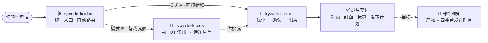

<p align="center">
  
</p>

<div align="center">
  <b style="font-family:Georgia,'Noto Serif SC','Songti SC','SimSun',serif; font-size:18px; color:#1C1916; letter-spacing:8px;">纸上算法 · PAPER ALGORITHM</b><br/>
  <span style="color:#5C5445; font-size:14px;">从一句话到一条生产线——把 AI 讲清楚，让每个普通人都看得懂、用得上。</span>
</div>

<p align="center">
  <a href="README.md">English</a> · <b>简体中文</b>
</p>

<p align="center">
  
  
  
  
</p>

---

## 🧭 这是什么

**试界 TryWorld 官方 AI 技能合集**——一条完整的中文口播视频生产线：从一句话到成片。选题、写稿、优化、出片、发布计划、邮件通知，全部打包成三个相互独立、即装即用的 Skill：

- **🎬 `tryworld-koubo`**——统一入口。一句人话，自动路由选题 → 写稿 → 优化 → 出片。
- **🎯 `tryworld-topics`**——AIHOT 选题。每天几百条 AI 资讯，压成 3–8 个能做、能火、不重复的选题。
- **📜 `tryworld-paper`**——纸上算法出片。口播稿 → 品牌化 16:9 横屏视频，含封面、标题、字幕。

装进 `~/.agents/skills` 后，在任何读取该目录的 AI 工具（Codex / Claude Code / Cursor / ZCode 等）的会话里说一句中文，整条链路就从选题清单、口播稿、渲染成片、封面标题，一直到自动邮件通知自动走完，不需要你记任何命令。

<div align="center">
<table style="border:1px solid #E4DCC8; border-radius:8px; background:#FBF7EC;">
<tr><td style="border-left:4px solid #C0452F; padding:14px 18px;">
  <b style="font-family:Georgia,'Noto Serif SC','Songti SC',serif; color:#1C1916; font-size:16px;">纸面是舞台，墨迹是文字，朱红是重点，印章是签名。</b><br/>
  <span style="color:#5C5445; font-size:13px;">三个技能各守一页，合起来就是一页会动的算法笔记——从「这周做什么」到成片交付、自动邮件通知、四平台发布计划。</span>
</td></tr>
</table>
</div>

## ⏱ 30 秒上手

**第 1 步 · 安装**——把技能文件夹复制到你的技能目录：

```powershell
Copy-Item -Path .\skills\* -Destination "$env:USERPROFILE\.agents\skills" -Recurse
```

**第 2 步 · 说话**——打开 AI 工具会话，直接说：

```text
帮我做一期口播
```

就这样。请求会被自动识别并路由到整条流水线，不用记任何命令。也可以直接点名技能（`$tryworld-koubo`、`$tryworld-topics`、`$tryworld-paper`）；带 `$` 的名字就是技能在会话里的呼号。

**第 3 步 · 收货**——流水线末端交付：渲染成片、横竖封面、平台标题、字幕、四平台发布计划，外加一封自动邮件通知。

---

## 📑 目录

- [这是什么](#-这是什么)
- [30 秒上手](#-30-秒上手)
- [三张纸页 · 技能总览](#-三张纸页--技能总览)
- [一条口播工作流](#-一条口播工作流)
- [纸上算法 · 设计系统](#-纸上算法--设计系统)
- [活人感门禁](#-活人感门禁)
- [安装与使用](#-安装与使用)
- [仓库结构](#-仓库结构)
- [使用与二创](#-使用与二创)
- [许可](#-许可)

---

## 🧩 三张纸页 · 技能总览

<div align="center">
<table>
<tr>
<td width="33%" valign="top" style="border:1px solid #E4DCC8; border-top:3px solid #C0452F; background:#FBF7EC; border-radius:6px; padding:12px 14px;">
  <b style="font-family:Georgia,'Noto Serif SC','Songti SC',serif; color:#1C1916; font-size:15px;">🎬 口播总入口</b><br/>
  <span style="color:#C0452F; font-size:12px; font-weight:bold;">tryworld-koubo</span>
  <br/><br/><span style="font-size:13px; color:#1C1916;">一句人话，自动路由选题、写稿、优化、出片。</span>
  <br/><br/><span style="font-size:12px; color:#2E5E8C;">产出：全流程交付 + 邮件通知</span><br/>
  <code style="font-size:12px;">$tryworld-koubo</code>
</td>
<td width="34%" valign="top" style="border:1px solid #E4DCC8; border-top:3px solid #C0452F; background:#FBF7EC; border-radius:6px; padding:12px 14px;">
  <b style="font-family:Georgia,'Noto Serif SC','Songti SC',serif; color:#1C1916; font-size:15px;">📜 纸上算法视频</b><br/>
  <span style="color:#C0452F; font-size:12px; font-weight:bold;">tryworld-paper</span>
  <br/><br/><span style="font-size:13px; color:#1C1916;">口播稿 → 品牌化横屏视频，一页会动的算法笔记。</span>
  <br/><br/><span style="font-size:12px; color:#2E5E8C;">产出：主视频 · 横竖封面 · 标题 · 字幕</span><br/>
  <code style="font-size:12px;">$tryworld-paper</code>
</td>
<td width="33%" valign="top" style="border:1px solid #E4DCC8; border-top:3px solid #C0452F; background:#FBF7EC; border-radius:6px; padding:12px 14px;">
  <b style="font-family:Georgia,'Noto Serif SC','Songti SC',serif; color:#1C1916; font-size:15px;">🎯 AI 口播选题</b><br/>
  <span style="color:#C0452F; font-size:12px; font-weight:bold;">tryworld-topics</span>
  <br/><br/><span style="font-size:13px; color:#1C1916;">每天几百条 AI 新闻，压成 3-8 个能做、能火、不重复的选题。</span>
  <br/><br/><span style="font-size:12px; color:#2E5E8C;">产出：选题清单（角度 · 来源 · 优先级）</span><br/>
  <code style="font-size:12px;">$tryworld-topics</code>
</td>
</tr>
</table>
</div>

---

## 🎬 一条口播工作流

只记一个入口：**`$tryworld-koubo`**。给稿走模式 A，要选题走模式 B。



---

## 🎨 纸上算法 · 设计系统

试界视频的视觉契约——**科学手稿 + 中文印刷传统**，一条不允许为省事让步的锁定契约。

<div align="center">
<table>
<tr>
<td align="center" style="background:#F4EFE4; color:#1C1916; padding:10px 14px; border:1px solid #E4DCC8;">
  <b style="font-family:Georgia,'Noto Serif SC','Songti SC',serif;">纸面</b><br/>
  <code>#F4EFE4</code><br/>
  <small>背景主色</small>
</td>
<td align="center" style="background:#1C1916; color:#F4EFE4; padding:10px 14px; border:1px solid #E4DCC8;">
  <b style="font-family:Georgia,'Noto Serif SC','Songti SC',serif;">墨黑</b><br/>
  <code>#1C1916</code><br/>
  <small>主文字 · 线条</small>
</td>
<td align="center" style="background:#C0452F; color:#F4EFE4; padding:10px 14px; border:1px solid #E4DCC8;">
  <b style="font-family:Georgia,'Noto Serif SC','Songti SC',serif;">朱红</b><br/>
  <code>#C0452F</code><br/>
  <small>唯一强调色</small>
</td>
<td align="center" style="background:#2E5E8C; color:#F4EFE4; padding:10px 14px; border:1px solid #E4DCC8;">
  <b style="font-family:Georgia,'Noto Serif SC','Songti SC',serif;">墨水蓝</b><br/>
  <code>#2E5E8C</code><br/>
  <small>次级批注 · 图表</small>
</td>
</tr>
</table>
</div>

| 维度 | 约定 |
|---|---|
| **字体** | 思源宋体（主标题）· 霞鹜文楷 / ZCOOL 小薇（批注）· 等宽字体（数据） |
| **动效** | 墨落纸 · 笔写入 · 盖章——全片三种签名动效 |
| **防伪** | 朱红「试界原创」印章右上角全程常驻，是视频唯一水印 |

---

## 🔒 活人感门禁

成片之前，每一版口播稿与平台标题都要过一道机器门禁——**禁的是修辞动作，不是字面**。换一套字做同一个动作，仍然算命中。

- **翻案腔**：先立读者没有的误解再推翻抬价。已知外衣不限于「不是……而是……」「并非……而是……」「不在于……而在于……」「表面……实际……」「看似……实则……」「你以为……其实……」「回头才发现」「说到底」「答案恰恰相反」，判断从正面下，先给判断再给依据。
- **同构排比**：三项以上整齐排比，两项为限。
- **抒情借喻**：不给抽象名词配具体动词（「时间保管细节」类），写具体事物不受影响。
- **动词名词化**：「实现了效率的提升」还原成「快了多少、省了几个人」。
- **标点分级**：破折号全禁；冒号只允许引出人物直接原话。
- **黑话两档**：绝对禁词 + 语境判断词，清单由检测器维护。

检测器 `tryworld-paper/scripts/check_prose.py`（源自 [human-writing](https://github.com/KKKKhazix/human-writing) v1.1.0，MIT）自动执行以上检查，并额外给出统计层提示——句长变异系数、连词密度、模型偏爱抒情词、「」金句密度。**硬禁项清零才允许进入用户确认闸门，失败不交付。**

---

## 🛠 安装与使用

### 安装

每个技能文件夹都是独立的 Skill，复制到本机技能目录即可：

```powershell
# 安装全部技能
Copy-Item -Path .\skills\* -Destination "$env:USERPROFILE\.agents\skills" -Recurse

# 或只安装单个技能
Copy-Item -Path .\skills\tryworld-paper -Destination "$env:USERPROFILE\.agents\skills" -Recurse
```

> 其他宿主（Codex / Claude Code / Cursor 等）同样读取 `~/.agents/skills`。

### 怎么触发

技能靠触发词自动命中，不需要记命令：

- 直接说人话：「帮我做一期口播」「这周做什么口播」「把这篇稿子做成视频」……
- 点名技能：`$tryworld-koubo` / `$tryworld-topics` / `$tryworld-paper`
- 直接粘贴口播稿要出片——路由会自动识别输入，直接进入出片流水线。

### 你说什么，得到什么

| 你说 | 走哪个技能 | 得到 |
|---|---|---|
| 帮我做一期口播 / 帮我选题 | tryworld-koubo | 全流程路由 · 发布计划 · 邮件通知 |
| 这周做什么口播 | tryworld-topics | 3–8 个选题（角度 · 来源 · 优先级） |
| 把这篇稿子做成视频 | tryworld-paper | 16:9 成片 · 横竖封面 · 标题 · 字幕 |

### 环境要求

这些技能按试界自己的工作流定制，默认假设如下——全部都可以在技能文件里自行调整：

- **Windows**——拉取数据与发通知邮件的脚本是 PowerShell（`scripts/*.ps1`）；跨平台替代方案见各技能的 `references/`。
- **Python 3**——改稿检查（`scripts/check_prose.py`）与云希配音（`scripts/tts_yunxi.py`）。
- **Node.js + HyperFrames**——渲染（`npx hyperframes render`）。
- **工作目录**——成片项目默认落在 `E:\Codex口播视频`，可按需在技能文件里改成你自己的目录。
- **邮件通知**——需要配置发信凭证（经 `$qq-email` 技能）；未配置时自动跳过，不阻塞交付。

每个技能文件夹里的 `SKILL.md` 都有完整工作流，以及在哪里改环境默认值。

---

## 🗂 仓库结构

```text
tryworld-skills/
├── assets/
│   ├── hero.svg                 # 品牌横幅
│   └── license-badge.svg        # 许可徽章
├── README.md                    # 索引（English）
├── README.zh-CN.md              # 索引（简体中文）
├── LICENSE                      # CC BY-SA 4.0
└── skills/
    ├── tryworld-koubo/          # 口播总入口（路由 + 邮件通知）
    ├── tryworld-paper/          # 纸上算法视频制作
    └── tryworld-topics/         # AIHOT 口播选题
```

---

## 🤝 使用与二创

- **请 fork，不要复制粘贴。** 用仓库右上角的 fork 按钮使用，保持与上游的连接和提交历史。
- **保留上游。** 任何二创仓库必须显著标注本仓库（`TryWorld2026/tryworld-skills`）与许可声明。
- **相同方式共享。** 二创必须使用同一许可（CC BY-SA 4.0）发布；不带本许可声明的仓库，不视为已获授权的二创。
- **商业使用欢迎**——只要署名与本许可随作品一起保留。

---

## ⚖️ 许可

本仓库采用知识共享 **署名-相同方式共享 4.0 国际（CC BY-SA 4.0）**：允许自由分享与演绎（含商业用途），但必须署名，且任何二创（衍生作品）必须使用同一许可发布。完整条款见 [LICENSE](LICENSE)。

[](https://creativecommons.org/licenses/by-sa/4.0/)

---

<p align="center"><sub>试界 TryWorld · 持续把 AI 讲清楚 · 让每个普通人都看得懂、用得上</sub></p>